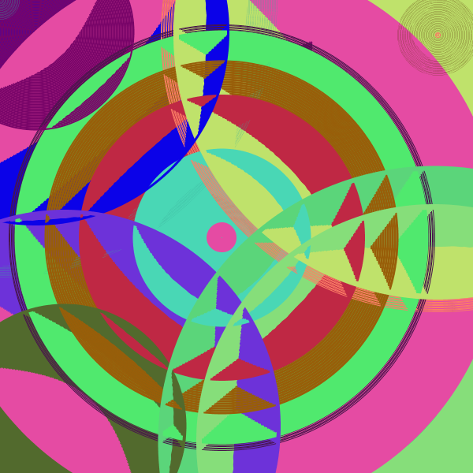

# Assignment 2

# Screenshot of Sketch

# Gif of Sketch

## Process

My process for this assignment was to create something that was fun and aesthetically pleasing. I wanted to include input from the user, even if it's just mouse clicks, so everytime you run the program you are generating your own artwork. Since I had previously worked with classes, I created a particle class to control the movement/size/color of my shapes. I saved all the shapes in an array called particles. In my main draw function, I loop through every circle in the particles array and call the update and display method from my class to draw them. From there, there was a lot of trial and error to get them to look interesting.

## Design Choices

To make it more attractive, I only used strokes for the circles with no fill. Since I don't draw the background everytime it loops, the circle look really interesting and overlap with each other in very interesting ways. I also use random numbers to generate the colors. However, I think the colors aren't as varied as I's like them to be so it woule be better to use a more specialized random color algorithm to make sure the colors are more varied.

## Challenges

My biggest challenge would have to be using Java in processing which is slightly different from p5.js which I am very used to. It took me a bit to get the syntax for the class right, and append to the array correctly which is a little bit different in java (team p5 for life). 

## Citations

I learned about particle classes in the decoding nature class from Daniel Shiffman's nature of code book, so the code for the class is adapted from there.
