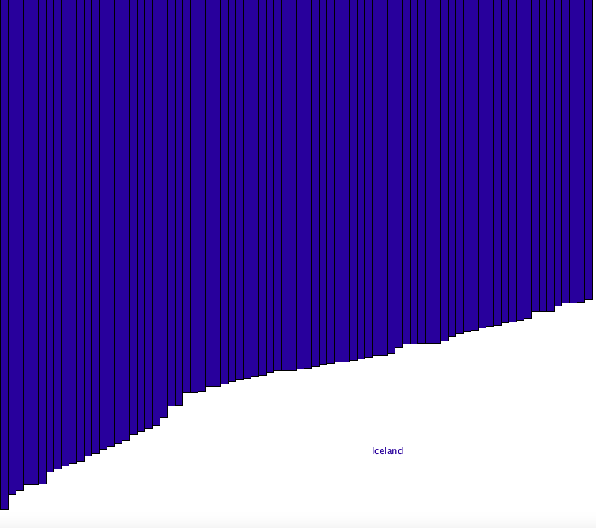

# World Happiness Report

## Process

In this assignment I created an upside down bar graph using the data from the world happiness report. I used the table class from processing to load the csv file.

## Table class

Table objects store data with multiple rows and columns, much like in a traditional spreadsheet, so it made a lot of sense for me to use them.

## Graph

I mapped the score of each country (its happiness index) to a value between zero and and the height of the page tp draw the triangles.

## Interactivity

I created two arrays, one with the names and the other one with the position of each rectangle (corresponding indices) If you hover over one of the rectangles then the name of the country appears.

## Challenges

I faced a lot of challenges creating this assignment. Firstly, having to start from scratch one again really delayed my process so I had to create something simpler this time around. 
In terms of the program itself, I faced a lot of problems with displaying the text. I wanted the page to display the text and then call background each time in the draw fucntion but that meant drawing over the graph since they were being drawn in the setup once. When I draw the graph in the draw function, I am unable to use the random fucntion without it looping over and over again.
I evetually stopped using the random function and added the graph to the draw function. The problem with this is that it's probably too fast? I am not exactly sure but when I hover the text appears sometimes and other times it doesn't. There is also some overlapping which doesn't make sense.

