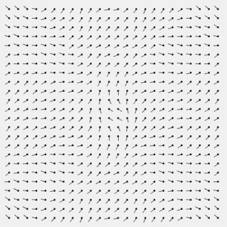

# Exploring Flow Fields

## Introduction

In this project, I wanted to expand on the class I created last time but add the use of perlin noise. I watched Daniel Shiffman's tutorial on flow field and found it really interesting. I decided to create a sketch where you can play around with flow fields and explore how they are created. The sketch is controlled by sliders that change some values so you can create art as you go.

  

  

  

  

## Flow Fields

Flow fields are based around a grid of vectors with each vector pointing in a different direction. The grid should be stored as a 2D array of floating point numbers. Each item in the array holds an angle and represents a point in the grid. 

## Perlin Noise

I used perlin noise to initialize the directions of the vectors. Perlin noise gives you smooth, continuous values across the 2D plane. It also has a nice variety of "scale" in the noise - there are some large features, medium features, and small features. Processing makes it very easy to use: the noise() function returns Perlin noise values (between 0.0 and 1.0) given x, y, and z coordinates.

## Process

My process began by doing a lot of research and watching tutorials on flow field. I then started by creating the grid with the vectors and then using perlin noise to initialize the vectors. I then edited the Particle class I created in my last assignment. I heavily made use of the PVector class as it made things so much easier. My particle class had 5 different methods.
1. Update: Applies forces to the particles (moves them) by updating the velocity to the position.
2. ApplyForce: Applies the force of the flow field to the particles
3. Follow: Calls applyForce to follow the path of the flow field.
4. Display: displays the particles by drawing lines between them.
5. UpdatePrev: updates the previous position to draw the line.

I then initialized two arrays, one to hold the particles and one to hold the vectors of the flow field itself. 

### Draw Function

In the draw function, I loop through the grid and and apply the noise function to the angles of the vectors and then loop throught the particles array and invoke the methods.

## ControlP5

I used the GUI library ControlP5 to create sliders to control different values in the sketch. The values are the angle which controls the direction, the color, and the noise values. This allows the sketch to me interactive and for the user to explore flow fields.

## Challenges

I had quite a few challenges working with this assignment. The main one being navigating Java after using Python and Javascript exclusively for a year. This slowed down my process. Other than that, I had a few out of index error that I think have to do with the way variables are initalized in Java or possibly the scope? I am still not sure but it took me a bit to figure out. In one instance, I even out an if statement to ensure that the array isn'y accessed out of bounds even though I still don't know why the variables were going out of bound.
