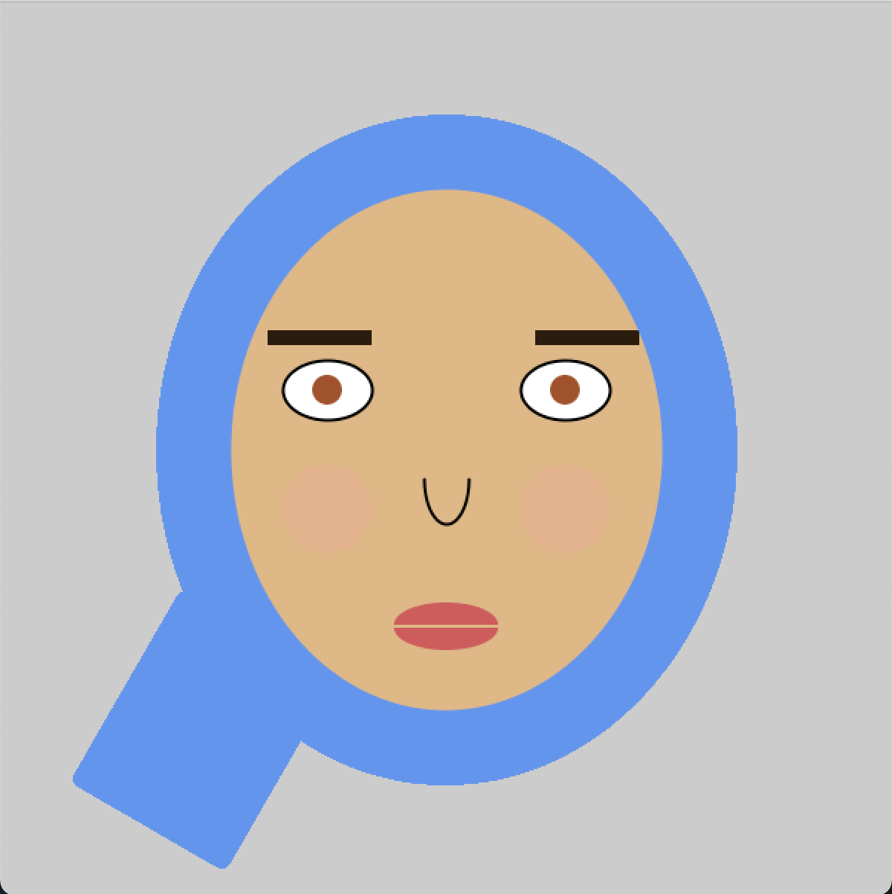

# Assignment 1

## Description

A self-portrait created using basic shapes in processing.

## Portrait

## Process

For this assignment, I initially created a processing sketch that uploads an image and reads every pixel value of the image and paint that location with a randomized shape of the same color. Even though it was fun, I realized I haven't really worked with shapes and their positioning which defeated the point so I decided to do something different. I created a porttait using basic shapes. Since I was running out of time at this point my sketch was really simple.

## Challenges

I think looking back I should have used a grid or been more conscious of my positioning since I think the symmetry of the face was a bit off. There wasn't anything particularly difficult but I think it is definitely interesting to think about symmetry and positioning from a more in depth prespective. After I was done with the assignment, I spent some time researching that.
