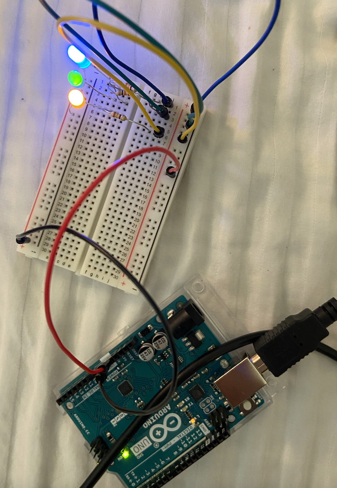

# Arduino Puzzle

## Idea 

My idea was to use 3 LEDs and 3 buttons to create a puzzle where you are supposed to figure out the code of how the LEDs change. For example, you have 3 LEDs. Blue, Red, and Green. When you run the program the red LED will light first, followed by the blue, and then the green. The program will pause for a while and then run again. This time it will be the Blue, then the red, then the green. You have to figure out how it changed from the first time to the second time by clicking the buttons. Since the red went first in the first round and second in the second round, you click the second button first. After that, the blue went second in the first round and first in the second round, so you click the first button. And then since the green didn't change and was always third you click the third button last.
The game isn't reeally about the colors but it's about paying attention to how the colors change. The buttons don't correspond to any colors but rather to a number according to the order they're placed on the breadboard.

## Schematic

## Pictures of my circuit

## Challenges

I faced a lot of problems trying to arrange my circuit and connect all the different components to the board. I was confused whether I had to connect my buttons to my LEDs or simply connect all my components to the board and then control them through the code. I am still not sure if the connection between the LEDs and the buttons is necessary. I tried to draw a schematic to show my understaing so far. Since I also wasn't able to test my code against my circuit, I was trying to rely on my understanding only. I put the circuit together and removed it so many times bit I wasn't sure what I was doing correctly or not. In terms of the code, it was relatively easy.

## Things I Learned

In addition to the digitalwrite and read functions, I was trying to figure out how to record the orders the buttons were pressed in. I learned that there is no way to do that in Arduino and I opted to use the millis function to record the time. I then compared the time that each button was pressed to see the order they were pressed in.
