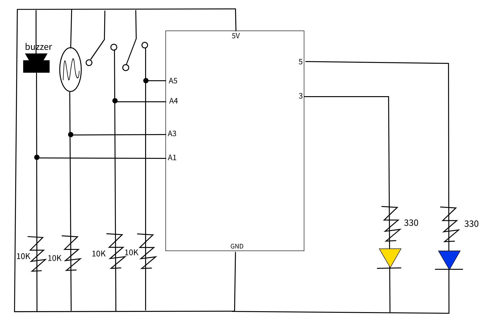
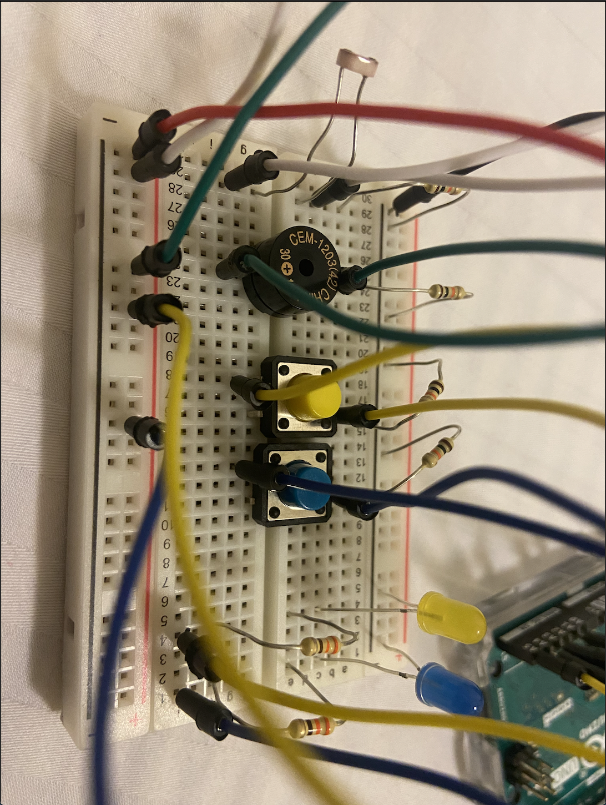
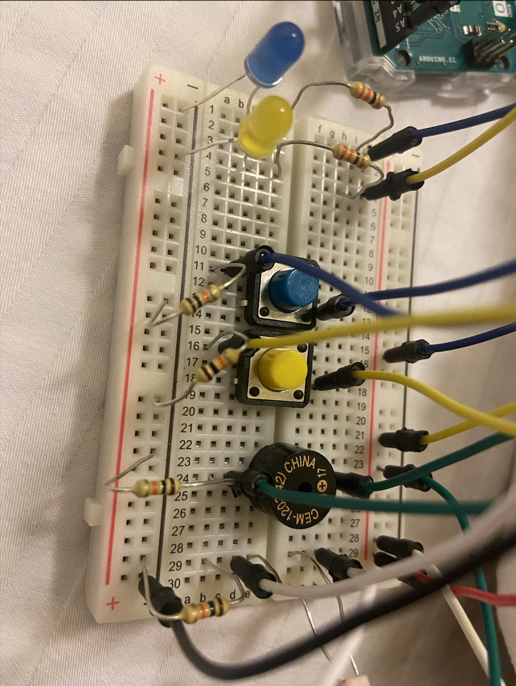

# Analog Input and Output: Gentle Alarm Clock

## Idea

For this assignment, I decided to use the light sensor and a switch to control 3 LEDs. The program starts by playing a sound that is stopped by clicking on one of the switches. I have 2 LEDs that are controlled by 2 switches. One switch is clicked when they wake up and the other switch when it's time to sleep. The intensity of the LEDs between the two clicks varies according to the light (or time of day). In the morning the lights would be off and then get brighter as it gets darker and then starts getting dimmer again to prepare for bedtime. When the nights out switch is clicked the LEDs turn off. When the morning switch is clicked, the lights turn on very dimmly and continue to get brighter throughout the day. This is meant to replicate normal days and nights as to help regulate sleeping cycles better. 

## Schematic

## Circuit

I connected the analog light sensor as well as the 2 switches first and made sure they are correctly reading inputs. I then connected the 2 LEDs and made sure they are correctly connected. I tried to build the circuit in a way where it was easy to access the switches but it was hard because the the input and output where on different sides and I wasn't able to put them on the same side. 

### Project Video

## Challenges

My biggest challenge was finding a way to to show the dimming effect on each individual light before it switches to the other one. I was sure that my code was correct because it worked when I gave it a range of my own. For some reason, it swtiched so fast the dimming effect wasn't noticeable. I finally realized that the analog values of the light sensor changed so fast and so frequently (because I was simply putting my finger over it) that the effect wasn't noticeable, but theoretically it would work if there is a gradual change.

I also struggles with building a circuit in a way where it was more organized. It got messy quickly. I tried to have everything on the same side but I ran out of space.

## Things I Learned

I learned how to debug my arduino code better. I also think it's important to check that each component is working on its own first so you don't spend a lot of time thinking the error is in the code when it's actually because you wired one of the components wrong. Always check each part of the code alone and then build on that.
