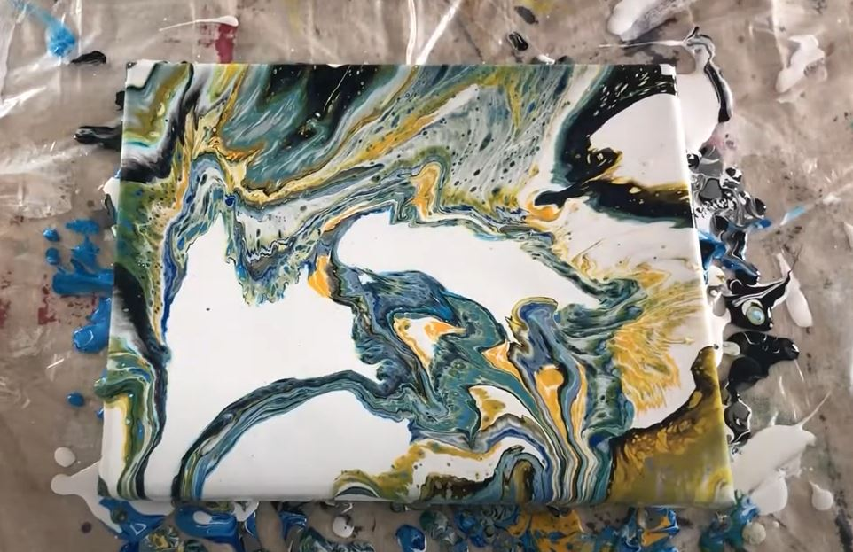
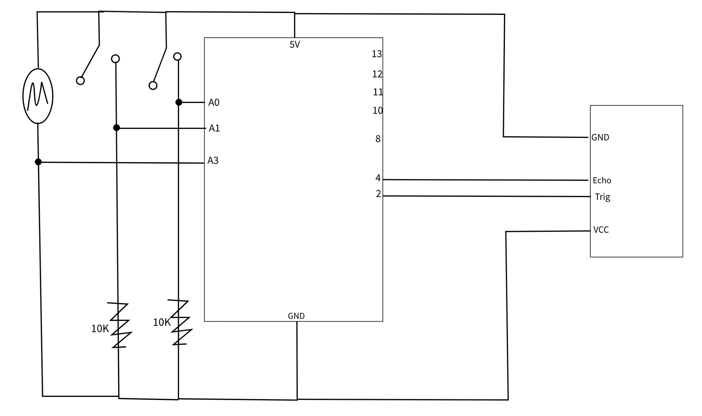
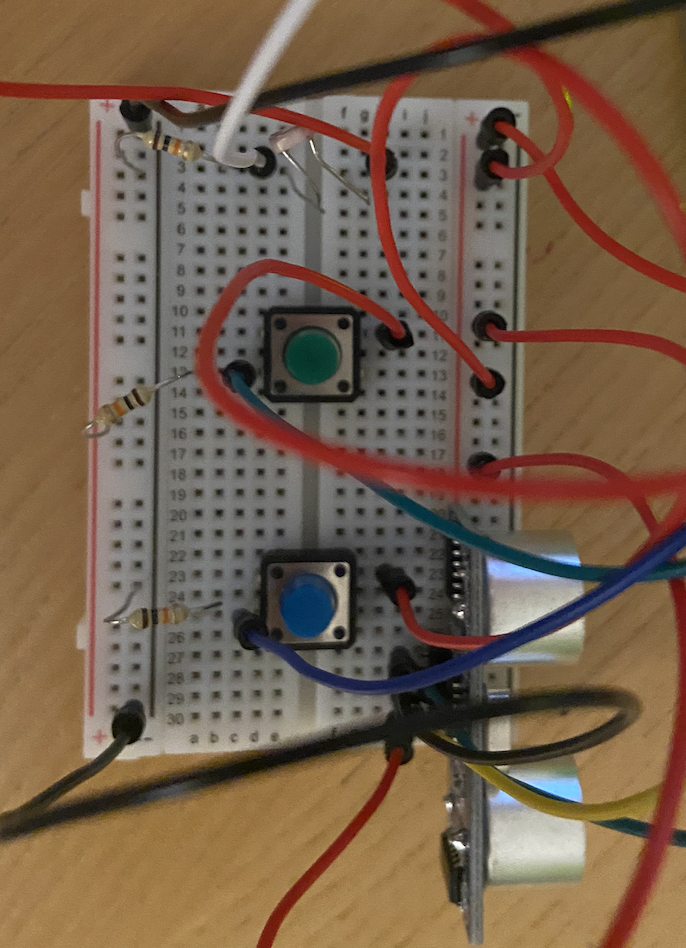
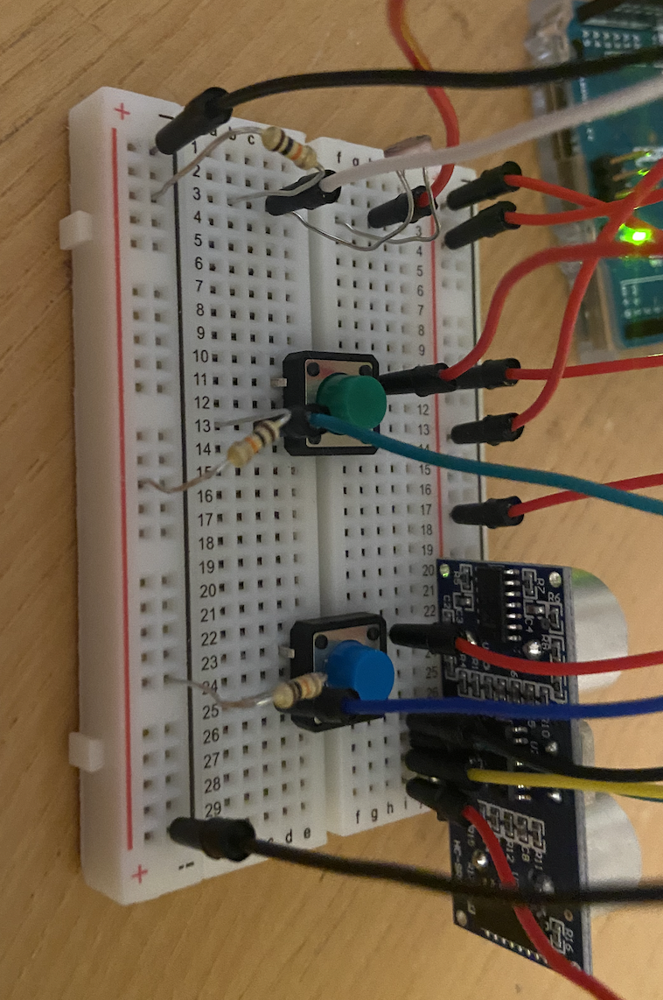

# How to break your Arduino?

## Creating Art with Arduino + Processing

My final project idea is to build a processing sketch that creates a art of some sort using input from the Arduino board. This will be a project that will allow the user to interact with project and create their unique artwork. I chose this project because I wanted to take advantage of the arduino sensors to their full capacity and make use of how unreliable the values can be if you're creating a set thing. In this project, you can mess around with the sensors and inputs as much as you want to see how interesting it will turn out to be. I titled this project how to break your arduino because the crazier your sensor values get, the more interesting the art becomes.

## Structure

The project is made up of 2 games. Each game uses the sensors to create a different type of artwork.

### Game 1

Game 1 is inspired by pour art or pour painting. 

In this type of work, acrylic paint is poured all over the sketch in an effor to create interesting looking patterns. The first step was to research and look for ways to implement that in my processing sketch. I looked all over the internet and managed to find a sketch on openprocessing that I based this game off of. I altered the sketch to match the pour art theme. The game consists of three different functions. One function controls the bruch stroke, and the two other control the paint splatter. 

### Game 2

Game 2 uses circles and their strokes to create intersting looking overlapping shapes. The shapes overlap and as you click the mouse they increase.

## Production

1. LOTS of looking at code online.
2. Once I was sure of my idea, and I had found the openprocessing sktech to help me, I spent a lot of time going through the whole code so I can have a very thorough understanding of it. 
3. After that, I went ahead and started implementing the first game.
4. Implementing the secong game was pretty easy going.
5. After that I built my circuit and connected my arduino to my processing sketch which went very smoothly (practice makes perfect!)
6. After everything was done, I worked on the homepage and aesthetics.

## Controls

A unique thing about the project is that I don't specify anywhere which sensor controls what. To run the sketches you have to use the mouse and then sensors at the same time. The whole point was to see how people can experiment with the arduino and try to compe up with interesting works of art. It is part of the experience to try and figure what each sensor controls on the sketch.

## Schematic

## Circuit

## Challenges

My main challenges in this project were related more to the processing side than to the arduino side. I had organizational problems in my processing code because I had everyhting in the same file. Looking back, I would definitely try to put each game in its own processing file.  I changed my idea a lot, which is something that I struglled with most of the semester. Unlike most people, I think my challenge is that I quit too fast and don't stick with original ideas, I quickly look for something else instead of asking for help. This posed very big challenges for me this time as I found myself running out of time toward the end. However, big lesson learned for next time.

There weren't any significant challenges faced with the arduino except one bug I had with handshaking were I wasn't sending anything back from the processing, but having done this mistake before in class, I quickly realized it.

On the processing end, most of my mistakes were due to being too hasty with the planning fo the code. In my computer science projects, I usually give a significant portion of time to plan the code, at least in my head before, however, I think because I am usually excited to see results with processing I jump right in. I believe I would benefit more with giving more time to plan the code.

## Interesting takes

I was very happy with how much I improved in building the circuits compared to the first time. Coding in Java has become significantly easier.
I also noticed how a lot of the creative process is based on recycling and upgrading ideas, whether yours or others. I put too much pressure on myself in the beginning to come up with something that is completely unique which brought back a lot the conversations we had in class on the creative process and what creativity is.

